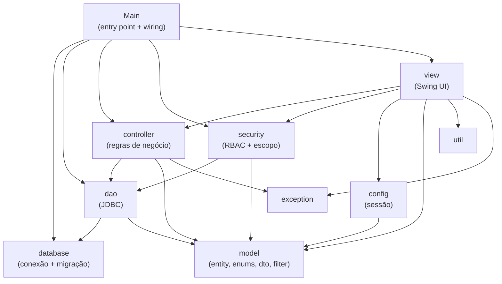
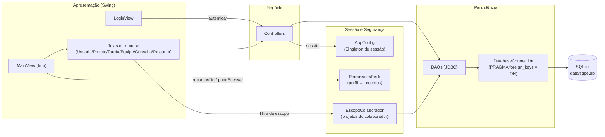
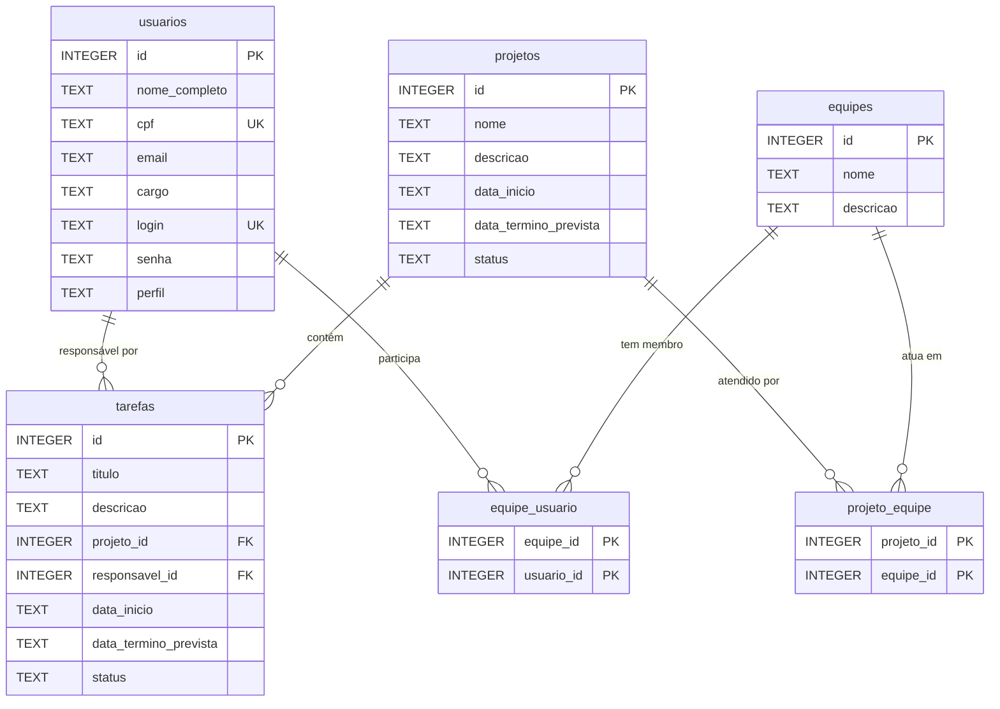
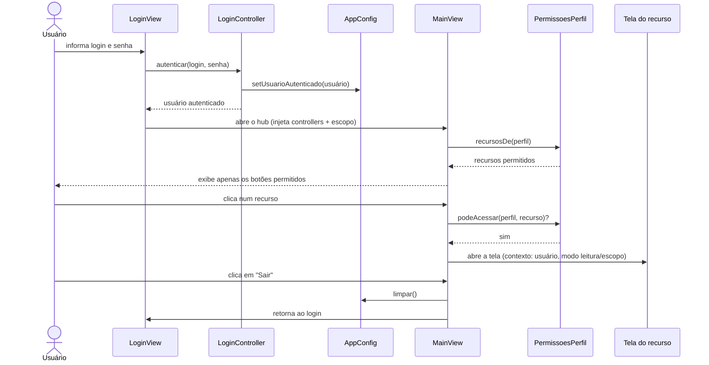
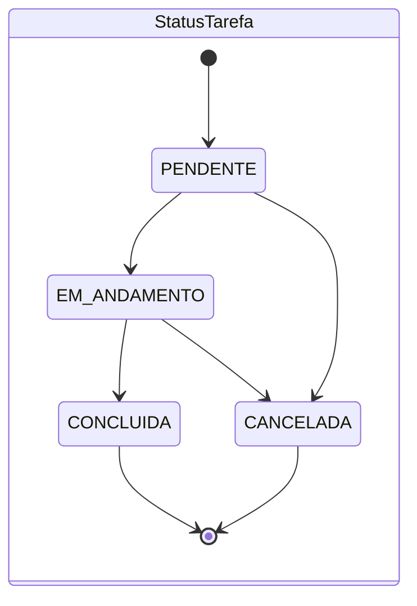

# SGPE — Sistema de Gestão de Projetos e Equipes

Aplicação **desktop Java Swing** para gestão de projetos, equipes, tarefas e
usuários, com **controle de acesso por perfil (RBAC)** e persistência local em
**SQLite**. A arquitetura segue o padrão **MVC clássico** (View → Controller →
DAO → banco), sem frameworks externos além do driver JDBC.

---

## Sumário

- [Funcionalidades](#funcionalidades)
- [Stack tecnológica](#stack-tecnológica)
- [Arquitetura](#arquitetura)
  - [Diagrama de pacotes](#diagrama-de-pacotes)
  - [Diagrama de componentes](#diagrama-de-componentes)
- [Modelo de dados](#modelo-de-dados)
- [Fluxos](#fluxos)
  - [Autenticação e navegação](#autenticação-e-navegação)
  - [Estados de projeto e tarefa](#estados-de-projeto-e-tarefa)
- [Perfis e permissões](#perfis-e-permissões)
- [Pré-requisitos](#pré-requisitos)
- [Instalação e configuração](#instalação-e-configuração)
  - [Linux](#linux)
  - [Windows](#windows)
- [Comandos principais](#comandos-principais)
- [Como executar](#como-executar)
- [Banco de dados](#banco-de-dados)
- [Estrutura do projeto](#estrutura-do-projeto)

---

## Funcionalidades

- **Autenticação** por login e senha, com sessão única em memória.
- **Tela principal (hub)** que expõe os recursos conforme o perfil do usuário.
- **Cadastro de usuários** (exclusivo do Administrador).
- **Cadastro de projetos, equipes e tarefas** (CRUD).
- **Vínculo** de equipes a projetos e de usuários a equipes.
- **Consulta de projetos** com filtros (nome, status, período, equipe).
- **Relatório de desempenho** por projeto (percentual de conclusão, contagens,
  equipes e responsáveis envolvidos).
- **Escopo do colaborador**: o colaborador visualiza apenas os dados das equipes
  de que participa e opera em modo leitura.

---

## Stack tecnológica

| Camada | Tecnologia | Versão |
|--------|------------|--------|
| Linguagem | Java (JDK) | **21** |
| Build | Apache Maven | 3.6+ |
| Interface gráfica | Java Swing | nativo do JDK |
| Banco de dados | SQLite (via `sqlite-jdbc` da Xerial) | 3.53.1.0 |
| Testes | JUnit Jupiter (JUnit 5) | 5.14.4 |
| Empacotamento | `maven-shade-plugin` (fat jar executável) | 3.6.2 |

Sem dependências de runtime além do driver SQLite — a interface usa apenas o
Swing do próprio JDK.

---

## Arquitetura

O projeto adota **MVC clássico** com injeção de dependências manual feita no
ponto de entrada (`Main`). Cada camada tem responsabilidade única:

- **View** (`view/`): telas Swing; não acessam o banco diretamente.
- **Controller** (`controller/`): regras de negócio e orquestração dos DAOs.
- **DAO** (`dao/`): persistência via JDBC puro (`PreparedStatement`).
- **Model** (`model/`): entidades, enums, DTOs e filtros.
- **Security** (`security/`): RBAC declarativo e escopo de dados do colaborador.
- **Database** (`database/`): conexão SQLite e migração do schema.
- **Config** (`config/`): sessão do usuário autenticado (Singleton).

### Diagrama de pacotes



### Diagrama de componentes



---

## Modelo de dados

Seis tabelas no SQLite (DDL em `src/main/resources/db/schema.sql`). As duas
tabelas de junção (`equipe_usuario`, `projeto_equipe`) modelam relações
muitos-para-muitos. Datas são persistidas como `TEXT` (ISO) e enums via o
`name()` da constante.



---

## Fluxos

### Autenticação e navegação

Após o login, o `LoginController` registra o usuário em `AppConfig` e abre a
`MainView`, que monta os botões conforme o perfil (RBAC). Cada recurso é aberto
sob demanda, recebendo o contexto do usuário (perfil/escopo) quando há filtro ou
modo leitura.



### Estados de projeto e tarefa

Os enums `StatusProjeto` e `StatusTarefa` representam o ciclo de vida. As
transições abaixo refletem o fluxo de negócio esperado (o modelo persiste o
status como texto livre; as transições não são impostas pelo código).




---

## Perfis e permissões

O acesso aos recursos é resolvido de forma declarativa em
`security/PermissoesPerfil` (mapa `PerfilUsuario → conjunto de recursos`). A
`MainView` renderiza apenas os botões permitidos e revalida o acesso antes de
abrir cada tela (defesa em profundidade).

| Recurso | Administrador | Gerente | Colaborador |
|---------|:---:|:---:|:---:|
| Usuários | ✅ | — | — |
| Projetos | ✅ | ✅ | — |
| Tarefas | ✅ | ✅ | ✅ (modo leitura, só as suas) |
| Equipes | ✅ | ✅ | — |
| Consultar Projetos | ✅ | ✅ | ✅ (apenas os do seu escopo) |
| Relatório de Desempenho | ✅ | ✅ | ✅ (apenas os do seu escopo) |

O **Colaborador** visualiza apenas dados das equipes de que participa
(`EscopoColaborador`) e não pode criar, editar nem excluir registros.

---

## Pré-requisitos

| Ferramenta | Versão mínima | Observação |
|------------|---------------|------------|
| JDK | 21 | Temurin/OpenJDK recomendado |
| Apache Maven | 3.6 | Gerencia build, testes e empacotamento |
| Git | qualquer | Para clonar o repositório |
| Ambiente gráfico | — | A interface Swing exige um display (não roda em servidor headless) |

Verifique as versões com:

```bash
java -version
mvn -version
```

---

## Instalação e configuração

### Linux

**Opção A — gerenciador de pacotes (Debian/Ubuntu):**

```bash
sudo apt update
sudo apt install -y openjdk-21-jdk maven git
```

**Opção B — SDKMAN (qualquer distribuição):**

```bash
curl -s "https://get.sdkman.io" | bash
source "$HOME/.sdkman/bin/sdkman-init.sh"
sdk install java 21-tem
sdk install maven
```

**Clonar e construir:**

```bash
git clone <URL-DO-REPOSITORIO>
cd project-manager
mvn clean package
java -jar target/sistema-gestao-projetos-equipes-1.0.0.jar
```

### Windows

**Opção A — winget (PowerShell):**

```powershell
winget install EclipseAdoptium.Temurin.21.JDK
winget install Apache.Maven
winget install Git.Git
```

Feche e reabra o terminal para recarregar o `PATH`. Se o Maven não definir o
`JAVA_HOME` automaticamente, configure-o (ajuste o caminho para a versão
instalada):

```powershell
setx JAVA_HOME "C:\Program Files\Eclipse Adoptium\jdk-21"
```

**Opção B — instalação manual:**

1. Baixe e instale o JDK 21 (Temurin/Oracle).
2. Baixe o Apache Maven, extraia e adicione a pasta `bin` ao `PATH`.
3. Defina `JAVA_HOME` apontando para a pasta do JDK.

**Clonar e construir (PowerShell ou CMD):**

```powershell
git clone <URL-DO-REPOSITORIO>
cd project-manager
mvn clean package
java -jar target\sistema-gestao-projetos-equipes-1.0.0.jar
```

---

## Comandos principais

Todos executados na raiz do projeto (onde está o `pom.xml`):

| Comando | Descrição |
|---------|-----------|
| `mvn clean` | Remove a pasta `target/` (artefatos de build) |
| `mvn compile` | Compila o código-fonte principal |
| `mvn test` | Executa a suíte de testes (JUnit 5) |
| `mvn package` | Compila, testa e gera o **fat jar** executável em `target/` |
| `mvn clean package` | Build limpo completo (recomendado antes de distribuir) |
| `mvn clean package -DskipTests` | Empacota sem rodar os testes (mais rápido) |

O artefato gerado é `target/sistema-gestao-projetos-equipes-1.0.0.jar`, já com
todas as dependências embutidas (`maven-shade-plugin`) e a classe principal
`br.com.dual.sgpe.Main` declarada no manifesto.

---

## Como executar

Após `mvn package`, execute o fat jar:

```bash
java -jar target/sistema-gestao-projetos-equipes-1.0.0.jar
```

No primeiro acesso, use as credenciais do administrador semeado
automaticamente:

| Login | Senha |
|-------|-------|
| `admin` | `admin` |

> A senha é armazenada em texto simples nesta versão (uso acadêmico). Não use
> credenciais reais.

---

## Banco de dados

- Engine: **SQLite**, arquivo único em `data/sgpe.db`, criado relativo ao
  diretório de execução.
- O schema é aplicado automaticamente na inicialização por
  `database/DatabaseMigrator` (a partir de `src/main/resources/db/schema.sql`,
  com `CREATE TABLE IF NOT EXISTS` — idempotente).
- As chaves estrangeiras são habilitadas por conexão (`PRAGMA foreign_keys = ON`
  em `DatabaseConnection`), pois o SQLite as desativa por padrão.
- Para reiniciar do zero, encerre a aplicação e remova o arquivo `data/sgpe.db`
  (mova para a lixeira) — ele será recriado e o admin inicial, semeado novamente.

---

## Estrutura do projeto

```text
project-manager/
├── pom.xml
├── README.md
├── data/                         # banco SQLite gerado em runtime (não versionado)
└── src/
    ├── main/
    │   ├── java/br/com/dual/sgpe/
    │   │   ├── Main.java          # ponto de entrada + wiring de dependências
    │   │   ├── config/            # AppConfig (sessão Singleton)
    │   │   ├── controller/        # regras de negócio
    │   │   ├── dao/               # acesso a dados (JDBC)
    │   │   ├── database/          # conexão e migração
    │   │   ├── exception/         # exceções de domínio
    │   │   ├── model/             # entity, enums, dto, filter
    │   │   ├── security/          # RBAC (PermissoesPerfil) e escopo (EscopoColaborador)
    │   │   └── view/              # telas Swing
    │   └── resources/db/
    │       └── schema.sql         # DDL das tabelas
    └── test/
        └── java/br/com/dual/sgpe/ # testes JUnit 5 (controllers, DAOs, security, util)
```
